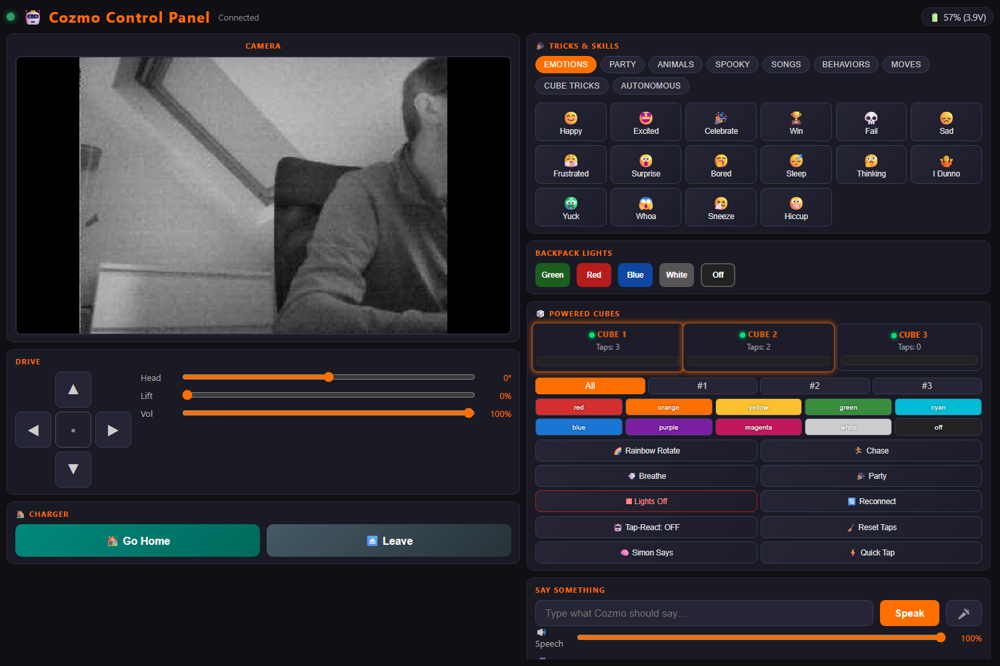
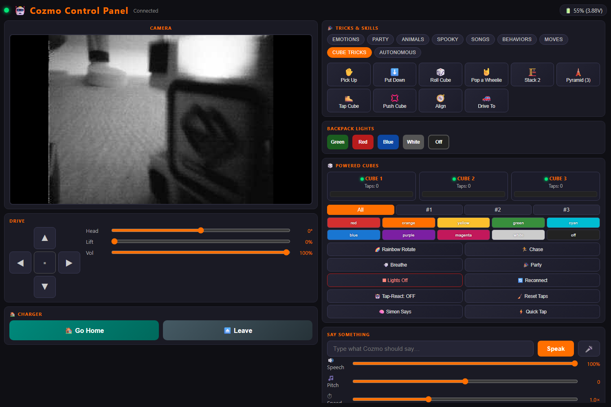
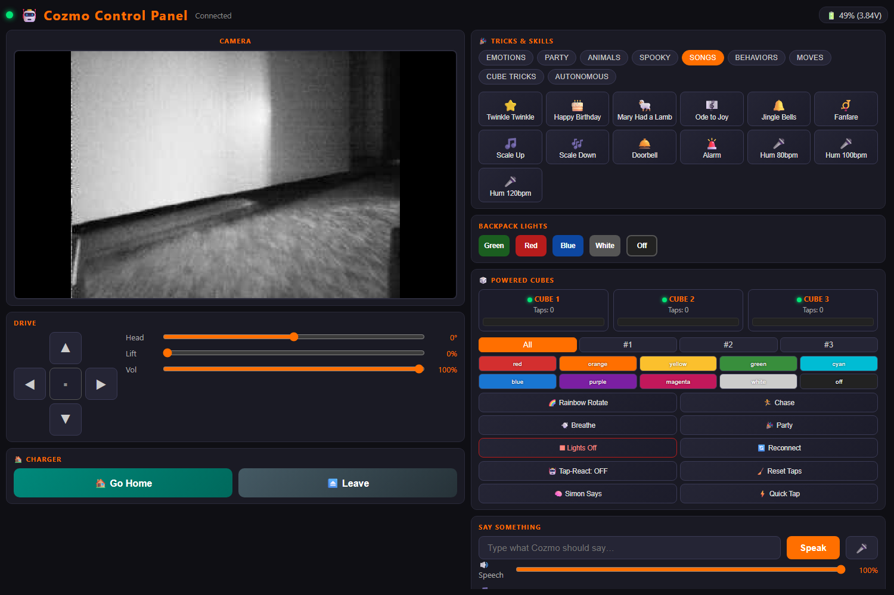
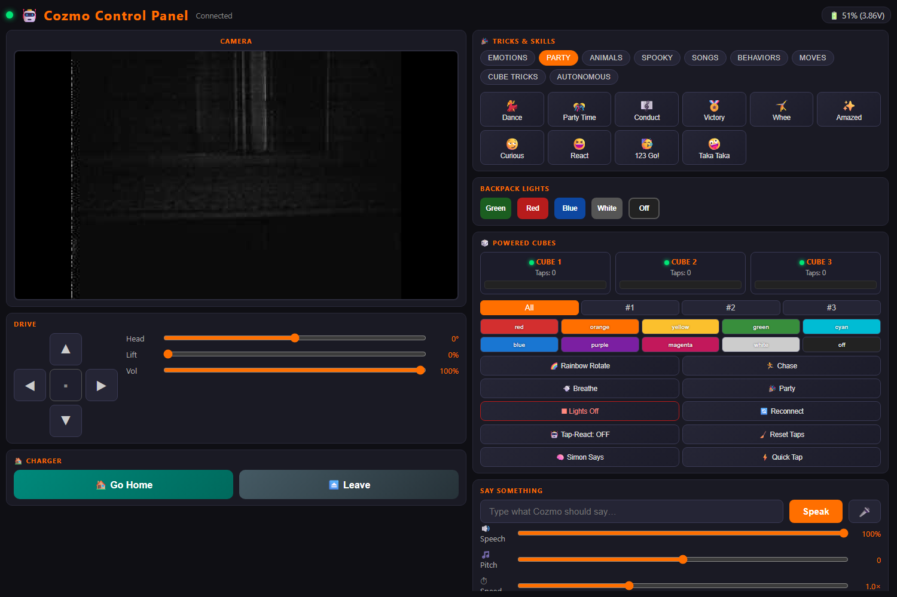
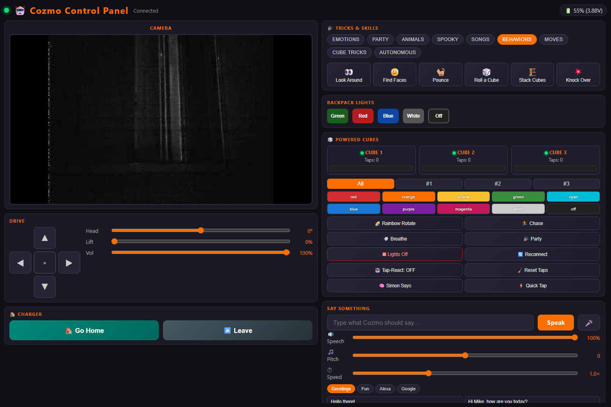
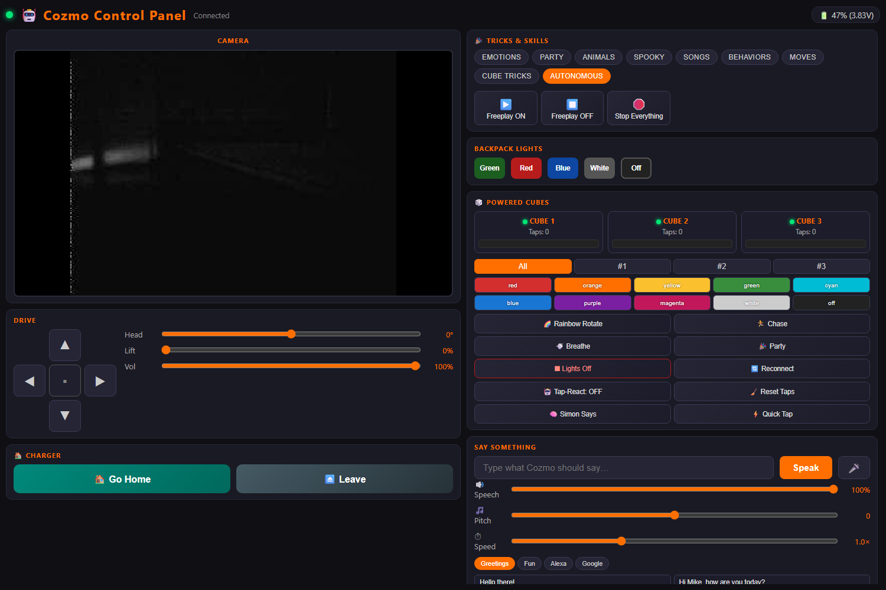

# 🤖 Cozmo Web Control Panel

A modern Flask web app that controls **Anki Cozmo** over the official SDK —
giving you live camera, drive controls, animations, songs, autonomous
behaviors, and auto-docking, all from any browser on your network.


## 📸 Screenshots

| Main dashboard | Cube Tricks |
| :--: | :--: |
|  |  |

| Songs | Party | Behaviors | Autonomous |
| :--: | :--: | :--: | :--: |
|  |  |  |  |

## ✨ Features

- 📷 **Live MJPEG camera feed**
- 🕹️ **D-pad drive** with hold-to-drive (mouse, touch, WASD/arrow keys)
- 🎚️ **Head, lift, volume sliders**
- 🔦 **Backpack lights** (green / red / blue / white / off)
- 🗣️ **Real Cozmo voice TTS** (`robot.say_text`)
- 🎉 **Tricks panel** — 60+ animations grouped into categories:
  - Emotions, Party, Animals, Spooky, Songs, Behaviors, Moves, Cube Tricks
- 🎵 **Songs** — pitched-note tunes via `robot.play_song`:
  Twinkle Twinkle, Happy Birthday, Mary Had a Little Lamb, Ode to Joy,
  Jingle Bells, scales, fanfare, doorbell, alarm, plus humming animations
- 🧠 **Autonomous behaviors** — Look Around, Find Faces, Pounce,
  Roll a Cube, Stack Cubes, Knock Over Cubes, and full **Freeplay** mode
- 🎲 **Cube interactions** — Pick Up, Put Down, Roll, Pop a Wheelie
- 🏠 **Auto-dock to charger** — scans the room, finds the charger,
  turns around and backs onto the contacts
- 🔋 **Live battery indicator** — pulses red when low, glows green on charger

## 🧰 Requirements

| Component | Version |
|---|---|
| Python | **3.7** (SDK requirement) |
| Cozmo app | **3.4.3** (`com.anki.cozmo`) on Android tablet |
| Cozmo firmware | **2381** (matches app 3.4.x) |
| `adb` (Android Platform Tools) | latest |

## 🚀 Setup

```powershell
# 1. Create the SDK virtualenv
py -3.7 -m venv .venv37
.\.venv37\Scripts\pip install cozmo flask pillow

# 2. Download Android platform-tools and unzip to C:\Cozmo\platform-tools
#    (https://developer.android.com/tools/releases/platform-tools)
```

## 📱 Tablet prep (every run)

1. Plug tablet into PC via USB → set USB mode to **File Transfer (MTP)**
2. Authorize the USB-debugging prompt
3. Open the **Cozmo** app → connect to Cozmo
4. Settings → **ENABLE SDK** (button must read *DISABLE SDK*)

## ▶️ Run

```powershell
$env:PATH = "C:\Cozmo\platform-tools;$env:PATH"
.\.venv37\Scripts\python.exe webapp_sdk.py
```

Then open <http://localhost:5000> (or your LAN IP from any device).

## 🗂️ Project layout

```
webapp_sdk.py        Flask backend + Cozmo SDK worker thread
templates/
  index.html         Dark-themed responsive UI
say_hello.py         Minimal SDK smoke-test script
```

## 🌐 HTTP API

| Endpoint | Method | Body / params |
|---|---|---|
| `/`            | GET  | Renders the UI |
| `/video_feed`  | GET  | `multipart/x-mixed-replace` MJPEG stream |
| `/status`      | GET  | `{connected, battery_v, battery_pct, battery_low, on_charger}` |
| `/cmd`         | POST | `{action, ...args}` |

### Actions

| `action` | Args |
|---|---|
| `forward` / `backward` / `left` / `right` / `stop` | — |
| `head`   | `{angle: -25..25}` |
| `lift`   | `{ratio: 0..1}` |
| `lights` | `{color: green\|red\|blue\|white\|off}` |
| `volume` | `{level: 0..65535}` |
| `say`    | `{text: str}` |
| `anim`   | `{trigger: <AnimationTrigger name>}` |
| `behavior` | `{name: find_faces\|look_around\|pounce\|roll_block\|stack_blocks\|knock_cubes}` |
| `behavior_stop` | — |
| `freeplay` | `{enable: bool}` |
| `move`   | `{kind: spin_left\|spin_right\|spin360\|fwd_short\|back_short}` |
| `cube`   | `{kind: pickup\|place\|roll\|wheelie}` |
| `sing`   | `{song: twinkle\|happy_bday\|mary\|ode_to_joy\|jingle\|fanfare\|scale_up\|scale_down\|doorbell\|alarm}` |
| `go_home` | — *(find charger and dock)* |
| `leave_charger` | — |

## 🛠️ Troubleshooting

- **"Disconnected" in browser** — make sure SDK toggle in the app is ON
  (it resets every app launch).
- **adb can't see tablet** — re-plug, set USB to *File Transfer*, accept
  the debug prompt on the tablet.
- **Cube tricks fail with "no cube visible"** — place a powered cube in
  front of Cozmo so he can see its marker.
- **"Go Home" can't find charger** — let him scan with a clear line of
  sight; the charger marker must be visible.

## 📄 License

Personal hobby project. Cozmo, the Cozmo SDK and assets are © Anki / Digital Dream Labs.
